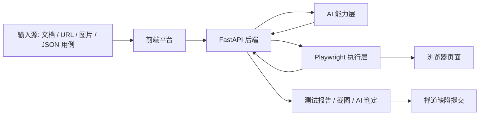

# Buglist

## AI 原生自动化测试平台

---

## 1. 项目概述

`Buglist` 是一个以 AI 为核心驱动的 UI 自动化测试平台。它的目标不是把传统自动化测试脚本换一个界面来执行，而是把“理解需求 -> 生成测试用例 -> 操作浏览器 -> 理解页面结果 -> 输出报告 -> 提交缺陷”这一整条链路打通。

在传统自动化测试体系里，最容易失效的往往不是浏览器本身，而是“定位规则”和“断言规则”过于刚性。页面一改版、DOM 一变化、className 一混淆，脚本就开始大量失效。`Buglist` 的核心思路是把 AI 引入到测试执行层，让系统能够更像人一样理解：

- 这一步想点的到底是什么
- 这个按钮是不是“顶部报名按钮”
- 这个页面最终状态有没有满足“已报名”
- 这个跳转后的页面是不是用户真正想验证的目标页

因此，`Buglist` 并不是一个“录制回放工具”，而是一个“AI 驱动的测试执行与判定平台”。

---

## 2. 要解决的问题

### 2.1 传统 UI 自动化的核心痛点

- 强依赖 DOM 结构、CSS 选择器和稳定属性
- 页面文案、布局、层级一变化，脚本就失效
- 很多测试需求来自自然语言，不适合人工逐条转成代码
- 复杂页面存在弹窗、登录态、新标签页、动态内容时，脚本很脆弱
- 测试执行完成后，还要人工整理报告和缺陷单

### 2.2 Buglist 的解决方案

`Buglist` 将问题拆成五个 AI 可理解的层次：

1. AI 解析自然语言测试步骤
2. AI 在页面中寻找可点击目标
3. Playwright 负责稳定执行浏览器动作
4. AI 基于截图做结果判定
5. 系统自动产出测试报告并提交到禅道

这个设计把“规则驱动”升级为“语义驱动 + 视觉驱动 + 浏览器自动化”的混合系统。

---

## 3. 核心亮点

### 3.1 AI 原生执行，不只是 AI 生成用例

很多测试工具只在“生成测试用例”阶段用 AI，真正执行时仍然依赖固定规则。`Buglist` 的差异化在于：

- AI 不只生成测试用例
- AI 也参与定位页面元素
- AI 也参与判断是否需要切换新标签页
- AI 也参与最终页面结果判定
- AI 还参与用例级的最终终态校验

这意味着项目真正把 AI 嵌进了执行引擎，而不是停留在辅助文案层。

### 3.2 面向复杂页面的语义定位能力

当测试步骤写的是：

- “点击最顶部的报名按钮”
- “点击右侧可用 USDT 右侧的加号按钮”
- “点击分享弹窗中的 twitter 按钮”

系统不会要求测试人员事先写死选择器，而是先把语义交给 AI 理解，再由执行器去页面中寻找最符合描述的目标。

### 3.3 AI 视觉断言

`Buglist` 不是只根据 DOM 文本判定结果，还可以对截图进行 AI 视觉分析。它适合处理这类难题：

- 验证弹窗是否真的出现
- 验证按钮状态是否变为“已报名”
- 验证是否真的打开到 Twitter / Facebook / Telegram 页面
- 验证页面是否被遮挡、弹窗是否影响测试判断

这类问题如果只靠规则，非常容易误判；而 AI 视觉断言更接近人工测试的判断方式。

### 3.4 登录态复用

对于需要登录才能执行的场景，`Buglist` 支持：

- 打开一个测试专用浏览器
- 手动登录
- 保存登录态
- 后续执行时自动复用登录态

这让系统能够覆盖大量真实业务系统，而不必每次都重新处理复杂登录流程。

### 3.5 缺陷闭环

执行失败不是终点。`Buglist` 已经打通了失败用例到禅道缺陷提交的能力：

- 自动整理失败原因
- 自动拼装原始测试步骤
- 自动附带 AI 判定说明
- 自动附带关键截图
- 一键提交到禅道

这让平台从“测试执行工具”进一步升级为“测试闭环平台”。

---

## 4. 适用场景

`Buglist` 适合以下类型的场景：

- Web 产品的 UI 回归测试
- 活动页、交易页、营销页等高变动页面测试
- 需要自然语言快速生成和执行测试的团队
- DOM 不稳定、选择器难维护的页面
- 需要快速演示 AI + 浏览器自动化结合能力的创新场景
- 需要在黑客松、PoC、MVP 阶段快速验证测试平台能力的团队

---

## 5. 产品能力全景

### 5.1 输入侧

支持多种方式进入测试流程：

- 文本产品文档
- 网页 URL 抓取内容
- PDF / DOCX / Excel 文档解析
- 图片 + 补充说明
- 直接导入 JSON 执行用例

### 5.2 生成侧

系统可以：

- 从产品文档生成测试用例
- 从长文档分段异步生成测试用例
- 生成适合执行器运行的结构化步骤

### 5.3 执行侧

当前执行器支持的动作包括：

- `打开页面`
- `输入`
- `点击`
- `等待`
- `验证`

执行时结合：

- Playwright 浏览器自动化
- AI 语义解析
- AI 元素定位
- AI 页面级验证
- AI 截图终态校验
- WebSocket 实时进度回传

### 5.4 输出侧

平台当前输出包括：

- 实时执行进度
- 单条用例通过 / 失败结果
- AI 判定说明
- 关键执行截图
- 汇总测试报告
- 一键提交禅道缺陷

---

## 6. 为什么这个项目有优势

### 6.1 比纯 Playwright 更灵活

纯 Playwright 很强，但它更适合规则明确、页面结构稳定的场景。`Buglist` 的优势在于，它把 AI 引入到了“规则难写、规则容易失效”的那一层。

### 6.2 比纯 Computer Use 更高效

纯 Computer Use 很像人，但速度慢、成本高、可重复性弱。`Buglist` 的设计是：

- 执行动作用 Playwright
- 理解和判定用 AI

这样兼顾了稳定性、速度和智能性。

### 6.3 比传统录制回放更适合真实业务

录制回放工具高度依赖固定页面行为，而 `Buglist` 更适合业务场景中的：

- 语言化需求
- 多变的页面结构
- 图标 / 弹窗 / 海报 / 状态类断言
- 新标签页和复杂跳转

### 6.4 更适合团队协作

它不是单纯的脚本仓库，而是一个本地可运行的平台，包含：

- 配置页
- 生成页
- 执行页
- 报告页
- 登录态管理
- 缺陷提交流程

这使它更容易向团队展示，也更适合黑客松评审理解项目完整度。

---

## 7. 技术架构

### 7.1 技术栈

- 前端：Next.js 14 + React 18 + Ant Design
- 后端：FastAPI
- 浏览器自动化：Playwright
- AI 接口：OpenAI 兼容 API
- 数据存储：本地 JSON 文件
- 实时通信：WebSocket
- 缺陷管理：禅道 API

### 7.2 架构分层



### 7.3 核心模块

#### 前端模块

- 测试平台主页面 `/`
- 设置页 `/settings`
- 聊天页 `/chat`
- 视觉识别页 `/vision`

#### 后端模块

- `routers/execute.py`：测试执行 WebSocket
- `routers/browser_auth.py`：登录态浏览器管理
- `routers/zentao.py`：禅道能力接入
- `services/execution_service.py`：执行服务编排
- `computer_use_platform/live_runner.py`：AI + Playwright 执行核心
- `computer_use_platform/ai_backend.py`：AI 视觉与语义能力

---

## 8. 关键工作流

### 8.1 从需求到执行

1. 输入产品文档、图片说明或 URL
2. 系统生成测试用例
3. 用户检查或补充测试步骤
4. 启动测试执行
5. AI 解析步骤语义
6. Playwright 执行动作
7. AI 判断页面结果
8. 输出报告和截图
9. 失败时一键提交禅道

### 8.2 登录场景工作流

1. 打开测试专用浏览器
2. 手动登录目标系统
3. 点击保存登录态
4. 后续自动复用该登录态执行测试

### 8.3 外链与新标签页场景

在分享、社交平台跳转等复杂场景下，系统支持：

- AI 决定是否需要切换新标签页
- 切换到新页面后再进行页面级 AI 断言

这使得 Twitter、Facebook、Telegram 等跳转验证更接近真实测试逻辑。

---

## 9. AI 设计理念

`Buglist` 的 AI 设计遵循三个原则：

### 9.1 AI 负责理解，浏览器负责执行

AI 擅长处理模糊语义和复杂页面判断；Playwright 擅长稳定执行浏览器操作。两者结合，比单独依赖其中任何一种都更合理。

### 9.2 AI 判定尽量贴近人工测试思维

例如“按钮是否已报名”这类断言，不应该仅靠 DOM 中出现“已报名”三个字就通过，而应该确认目标按钮本身的状态是否变化。这也是当前项目持续强化的方向。

### 9.3 最终结果必须可解释

平台不仅输出通过 / 失败，还输出：

- AI 判定理由
- 关键截图
- 失败步骤
- 页面状态说明

这样评审、开发和测试人员都能快速理解结论。

---

## 10. 演示亮点建议

如果把这个项目拿去做黑客松展示，建议重点演示以下几个片段：

### 10.1 自然语言生成测试用例

输入一段需求描述，快速生成结构化测试用例。

### 10.2 AI 找按钮

给出类似“点击顶部报名按钮”“点击右侧可用 USDT 右边的加号按钮”这样的自然语言步骤，展示系统如何在复杂页面中寻找目标。

### 10.3 AI 视觉判定

执行完成后展示：

- 弹窗是否出现
- 按钮状态是否变化
- 页面是否真的跳转成功

### 10.4 登录态复用

展示专用浏览器登录一次后，后续测试自动复用登录态。

### 10.5 一键提交禅道

展示失败结果自动整理为缺陷单并提交到禅道，突出闭环价值。

---

## 11. 如何启动项目

### 11.1 环境要求

- Node.js 18+
- npm 9+
- Python 3.10+

### 11.2 安装前端依赖

```bash
cd frontend
npm install
```

### 11.3 安装后端依赖

```bash
cd backend
python -m pip install -r requirements.txt
```

### 11.4 安装 Playwright 浏览器

```bash
cd backend
python -m playwright install chromium
```

建议本机也安装 Chrome，以便执行专用登录浏览器场景。

### 11.5 启动后端

在仓库根目录执行：

```bash
python -m uvicorn backend.main:app --reload --host 0.0.0.0 --port 8000
```

后端地址：

- [http://127.0.0.1:8000](http://127.0.0.1:8000)

### 11.6 启动前端

另开一个终端：

```bash
cd frontend
npm run dev
```

前端地址：

- [http://127.0.0.1:3000](http://127.0.0.1:3000)

---

## 12. 快速上手

### 12.1 配置 AI

进入 `/settings` 页面，填写：

- AI Base URL
- API Key
- Model

### 12.2 配置禅道

同样在设置页填写：

- 禅道地址
- 账号
- 密码或 Token

### 12.3 生成并执行测试

1. 在主页面输入产品文档或导入 JSON 用例
2. 生成测试用例
3. 点击执行
4. 查看实时进度、截图和 AI 结论

### 12.4 需要登录的页面

1. 打开测试专用浏览器
2. 手动登录
3. 保存登录态
4. 回到平台执行测试

---

## 13. 当前项目成熟度说明

`Buglist` 当前是一个完成度较高的本地 MVP / Demo 平台，适合：

- 黑客松展示
- AI 测试执行思路验证
- 团队内部 PoC
- 新型自动化测试平台原型验证

它已经具备完整闭环，但仍在持续优化：

- 更强的 AI 终态校验
- 更稳定的遮挡弹窗处理
- 更丰富的断言类型
- 更完善的测试用例管理能力
- 更标准化的企业级部署方式

这意味着它既有“能跑起来、能展示、能闭环”的现实价值，也保留了继续扩展为正式产品的成长空间。

---

## 14. 未来规划

### 14.1 短期规划

- 所有验证步骤强制走 AI 截图判定
- 自动识别并处理遮挡弹窗
- 更丰富的页面级工具，例如切页、滚动、区域聚焦
- 提升复杂交易页、活动页、弹窗页的元素定位成功率

### 14.2 中期规划

- 支持批量执行和队列调度
- 支持测试报告导出
- 支持多项目配置隔离
- 支持更多缺陷平台接入

### 14.3 长期规划

- 支持团队协作和权限管理
- 支持云端任务执行
- 支持历史回放与失败根因分析
- 打造 AI 原生测试平台标准工作流

---

## 15. 一句话总结

`Buglist` 的核心价值在于：  
**让自动化测试从“依赖脆弱规则的脚本执行”，升级为“由 AI 理解、由浏览器执行、由视觉判断、并最终闭环到缺陷系统”的智能测试平台。**

如果把它放到黑客松语境里，它展示的不只是一个测试工具，而是一种新的测试执行范式。
